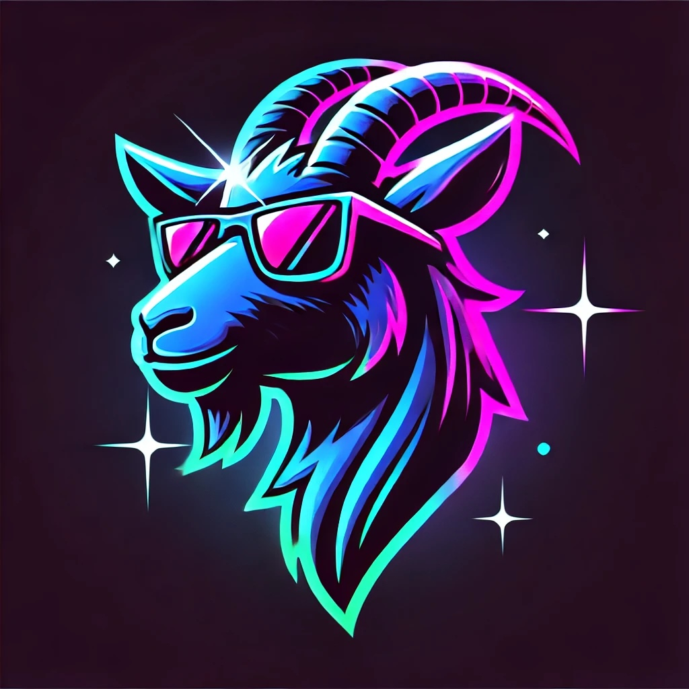
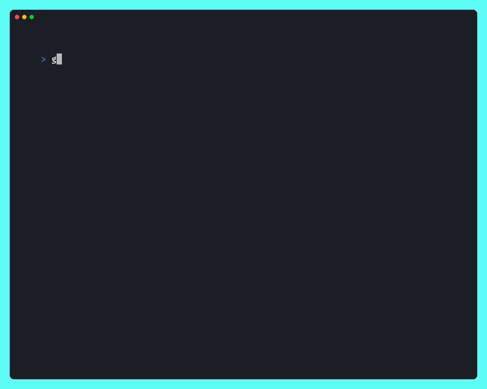

# goat



[](https://github.com/maragudk/goat/actions/workflows/ci.yml)

goat the GOAT LLM CLI.

Chat with multiple LLMs at the same time, both locally and with online models.

⚠️ Under heavy development, things will break.

```shell
go install maragu.dev/goat@latest
```

Supported LLMs:
- Llama via [llama.cpp](https://github.com/ggerganov/llama.cpp)
- Models from [OpenAI](https://openai.com)
- Models from [Anthropic](https://www.anthropic.com)
- Models from [Groq](https://groq.com)

Made with ✨sparkles✨ by [maragu](https://www.maragu.dev/).

## Demo


