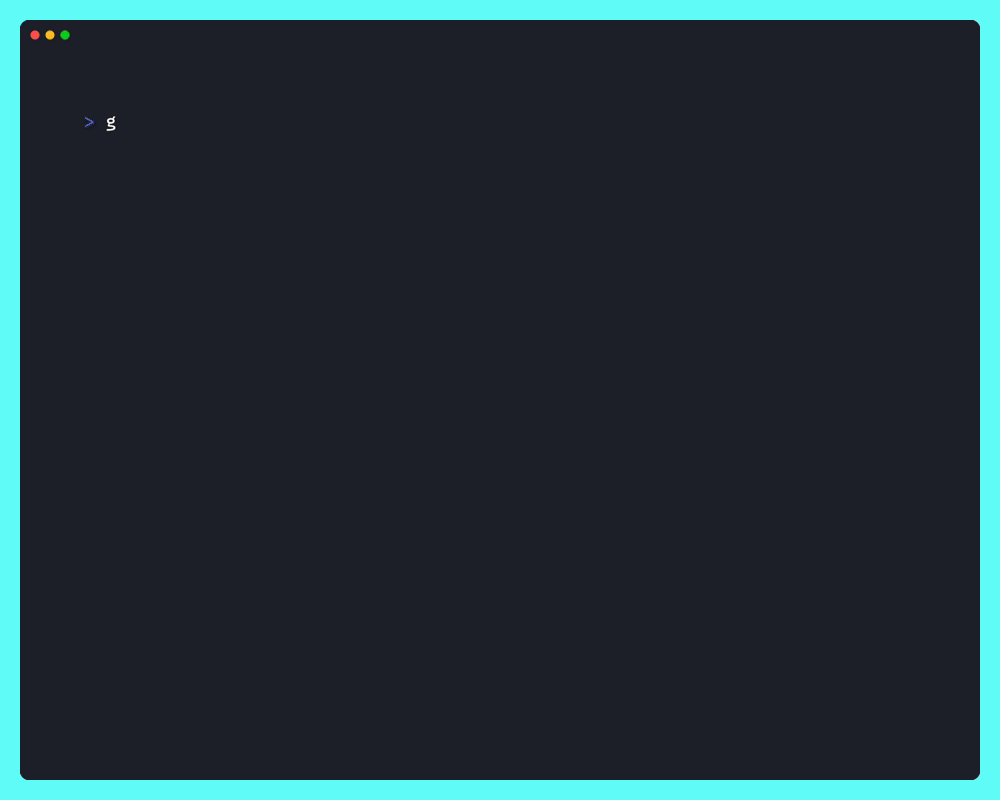

# goat


[](https://github.com/maragudk/goat/actions/workflows/ci.yml)

goat the GOAT LLM CLI.

```shell
go install maragu.dev/goat@latest
```

Made with ✨sparkles✨ by [maragu](https://www.maragu.dev/).

## Demo


